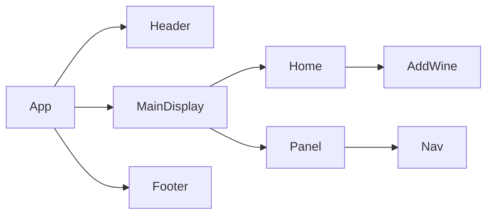

# Product Requirements Documentation

**Summary**
| Field | Detail |
|-------|--------|
| Project Name | Vineyard Wine App|
| Description |Wine Menu and database for all wine connoisseurs |
| Developers | Chedeline Viljean, Nathan Yi, Omari Archer, Calvin Harris  |
| Live Website | https://sasquatch-winos.netlify.app/ |
| Repo | https://github.com/vchedeline/Wine-Backend,  |

## Problem Being Solved and Target Market

For the wine distributor, restaurant owner or even the modest collector the Vineyard App makes selecting your next exquiste Wine easy, choose from a large selection of aged imports guarenteed to revitalize your collection. 

## User Stories

- As a user, I want to add a wine to list
- As a user, I want to be able to delete a specific wine
- As a user, I want to click on a wine and see the details
- As a user, I want to be able to edit and update a specific wine
- As a user, I want to categorize the wines

## Route Tables

| Endpoint | Method | Response | Other |
| -------- | ------ | -------- | ----- |
| /vineyard | GET | Display of all Wine | |
| /wine | POST | Create new Wine | body must include data for new item |
| /wine/:id | GET | Get a specific Wine | |
| /wine/:id | PUT | Update/Change Wine information | body must include updated data |
| /:wine/:id | DELETE | Delete a wine by id | |

## Component Architecture

## User Interface Mockups

